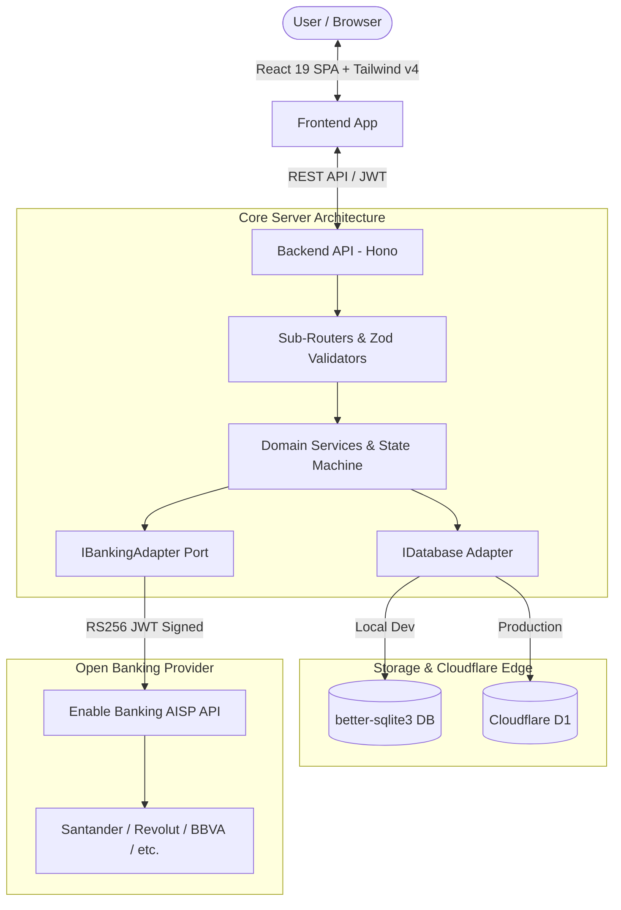

<div align="center">

# 🏦 Banky


**Modern, Privacy-First Open Banking Dashboard & Personal Finance Aggregator**


[](LICENSE)
[](https://www.typescriptlang.org/)
[](https://react.dev/)
[](https://hono.dev/)
[](https://workers.cloudflare.com/)
[](https://tailwindcss.com/)

Banky connects your bank accounts (Santander, Revolut, and 2,500+ EU/UK banks) via [Enable Banking](https://enablebanking.com) Open Banking AISP (Read-Only). It provides instant balance tracking, smart categorization rules, custom cutoff billing cycles, budget tracking, and real-time transaction insights — completely self-hostable on Cloudflare Serverless Edge or local Node.js.

[Key Features](#-key-features) •
[Architecture](#-architecture) •
[Quick Start](#-quick-start) •
[Deployment](#-deployment) •
[Security](#-security--privacy) •
[API Reference](#-api-endpoints) •
[Contributing](#-contributing)

</div>

---

## ✨ Key Features

- 🏦 **Multi-Bank Aggregation (AISP Read-Only)**: Securely link multiple banks in one place. Banky never requires or requests transaction/transfer permissions.
- ⚡ **Sub-Millisecond Queries & Local Caching**: Financial data is synced into a fast local SQLite (or Cloudflare D1) database. Browsing balances and transactions is instantaneous.
- 🏷️ **Smart Categorization Engine**: Rule-based transaction tagging, regex/pattern matching, and manual quick-categorization that remembers your preferences.
- 📅 **Custom Cutoff Billing Cycles**: Configure custom statement cutoff days per account or global views (e.g., 20th of the month) to match your real billing habits.
- 📊 **Budgets & Spending Analytics**: Real-time spending limits, category allocations, and progress indicators.
- 🔐 **Zero-Trust Security**:
  - **AES-256-GCM** encryption for bank session IDs at rest.
  - **PBKDF2-HMAC-SHA256** (100,000 iterations + salt) for user authentication.
  - **RSA-4096** signed JWTs for Open Banking upstream communication.
  - **Stateless HMAC-SHA256** anti-CSRF OAuth verification for edge runtimes.
- 📱 **Responsive & Modern UI**: Built with React 19, Tailwind CSS v4, Lucide icons, mobile navigation, and Excel (`.xlsx`) export.

---

## 🏛️ Architecture

Banky is designed using **Ports & Adapters (Hexagonal Architecture)**. The domain logic and sync services interact with interfaces (`IBankingAdapter`, `IDatabase`), allowing seamless switching between local SQLite (`better-sqlite3`), Cloudflare D1 in the edge worker, or mock adapters for automated testing.



---

## 🧰 Tech Stack

| Layer | Technologies |
|---|---|
| **Frontend** | React 19, Vite, Tailwind CSS v4, React Router DOM v7, Lucide Icons |
| **Backend** | Hono, Zod, Drizzle ORM, Web Crypto API |
| **Database** | SQLite (`better-sqlite3` for local dev / Cloudflare D1 for serverless edge) |
| **Security** | AES-256-GCM, PBKDF2-HMAC-SHA256, RSA-4096 RS256, HMAC-SHA256 |
| **Deployment** | Cloudflare Workers, Cloudflare Pages, Docker |

---

## 📋 Prerequisites

1. **Node.js** v20.0.0+ and **npm** (or **pnpm**)
2. **OpenSSL** (pre-installed on Linux/macOS; available via Git Bash or Chocolatey on Windows)
3. An account on [Enable Banking Control Panel](https://enablebanking.com)

---

## 🔐 Security Setup & Enable Banking Credentials

### 1. Generate RSA 4096-bit Key Pair (for Open Banking API)

Enable Banking authenticates API requests via RS256 signed JWTs:

```bash
# 1. Generate RSA Private Key
openssl genrsa -out private.key 4096

# 2. Extract Public Key
openssl rsa -in private.key -pubout -out public.key
```

### 2. Register Application in Enable Banking

1. Log in to the [Enable Banking Control Panel](https://enablebanking.com).
2. Create a new Application and upload `public.key`.
3. Copy your generated **Application ID** (`APP_ID` - UUID format).
4. Set the **Redirect URL** in the console: `http://localhost:5173/auth/callback` (or your production frontend URL).

> [!NOTE]
> **Enable Banking Restricted Production Mode**: Enable Banking starts in *Restricted Production* mode. In this mode, live banking data access is limited to the IBANs / test accounts you explicitly whitelist in the Enable Banking console.

### 3. Generate AES-256-GCM Encryption Key

Generate a secure 32-byte hex key (64 characters) to encrypt bank session IDs at rest:

```bash
openssl rand -hex 32
```

---

## 🚀 Quick Start (Local Development)

### 1. Backend Setup

```bash
cd server
npm install

# Copy environment variables
cp .env.example .env
```

Edit `server/.env` with your credentials:

```env
PORT=3001
NODE_ENV=development
APP_ID=your-enable-banking-app-id
ENCRYPTION_KEY=your-64-character-hex-key
ENABLE_BANKING_REDIRECT_URL=http://localhost:5173/auth/callback
FRONTEND_URL=http://localhost:5173
```

Inject the RSA Private Key cleanly using the included helper:

```bash
node ../format-key.mjs --env
```

Start the backend:

```bash
npm run dev
```

*The API server will run at `http://localhost:3001`.*

### 2. Frontend Setup

In a new terminal:

```bash
cd client
npm install

# Copy environment variables
cp .env.example .env

# Start Vite dev server
npm run dev
```

*Open `http://localhost:5173` in your browser.*

---

## ⚡ Deployment

### Option A: Cloudflare Workers + D1 + Pages (Recommended Serverless Edge)

#### 1. Backend on Cloudflare Workers & D1

```bash
cd server

# 1. Create Cloudflare D1 database
npx wrangler d1 create banky-db

# 2. Update database_id in wrangler.toml with the ID returned above

# 3. Apply database migrations to production D1
npm run d1:migrate:remote

# 4. Set production secrets in Cloudflare Workers
npx wrangler secret put PRIVATE_KEY_PEM
npx wrangler secret put APP_ID
npx wrangler secret put ENCRYPTION_KEY

# 5. Deploy Worker
npm run deploy
```

#### 2. Frontend on Cloudflare Pages

```bash
cd client

# 1. Build production static bundle
npm run build

# 2. Deploy to Cloudflare Pages
npx wrangler pages deploy dist --project-name=banky-client
```

### Option B: Docker Deployment

```bash
# Build server image
docker build -t banky-server ./server

# Run container with persistent SQLite volume
docker run -d \
  --name banky-api \
  --env-file server/.env \
  -p 3001:3001 \
  -v banky-data:/app/data \
  banky-server
```

---

## 📡 API Endpoints

| Method | Endpoint | Description | Auth Required |
|---|---|---|---|
| `GET` | `/health` | Service healthcheck & status | No |
| `POST` | `/auth/register` | Register a new multi-tenant user | No |
| `POST` | `/auth/login` | Authenticate and receive JWT | No |
| `GET` | `/auth/banks` | List supported banks for country | Yes |
| `POST` | `/auth/connect` | Initiate OAuth consent flow | Yes |
| `POST` | `/auth/callback` | Exchange OAuth code for session | Yes |
| `POST` | `/sync` | Trigger account & transaction sync | Yes |
| `GET` | `/balance` | Global consolidated balances | Yes |
| `GET` | `/accounts` | Connected accounts & computed balances | Yes |
| `GET` | `/accounts/:id` | Specific account details | Yes |
| `GET` | `/transactions` | Paginated transactions with search & filters | Yes |
| `GET` | `/categories` | List user categories & rules | Yes |
| `POST` | `/categories` | Create or update category rule | Yes |
| `GET` | `/budgets` | User budgets & category analytics | Yes |

---

## 🧪 Verification & Typechecking

```bash
# Typecheck backend
cd server && npm run typecheck

# Typecheck frontend
cd client && npm run typecheck

# Run manual integration verification scripts
cd server && npm run test:auth
```

---

## 🤝 Contributing

Contributions, issues, and feature requests are welcome!
Please check our [Contributing Guide](CONTRIBUTING.md) and [Code of Conduct](CODE_OF_CONDUCT.md) before submitting PRs.

1. Fork the Project
2. Create your Feature Branch (`git checkout -b feat/AmazingFeature`)
3. Commit your Changes (`git commit -m 'feat(dashboard): add transaction tag filter'`)
4. Push to the Branch (`git push origin feat/AmazingFeature`)
5. Open a Pull Request

---

## 📄 License

Distributed under the **MIT License**. See [`LICENSE`](LICENSE) for more information.
